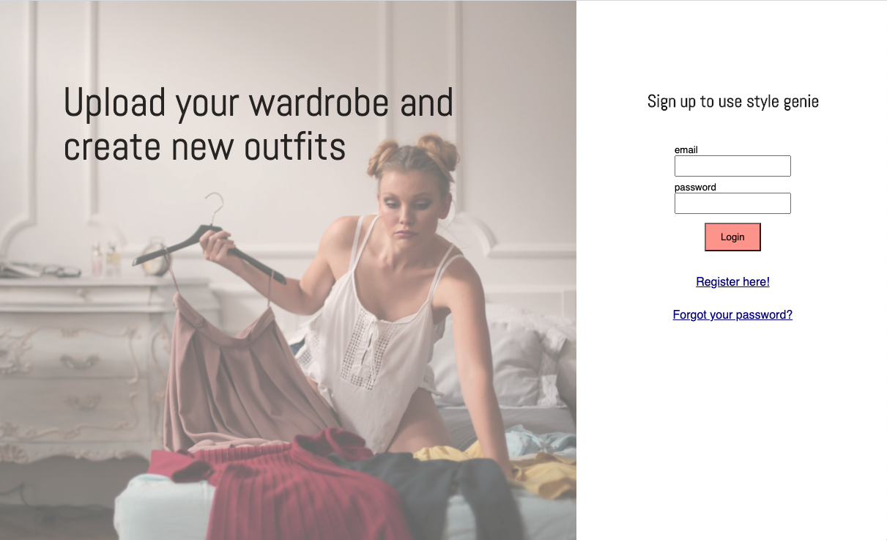
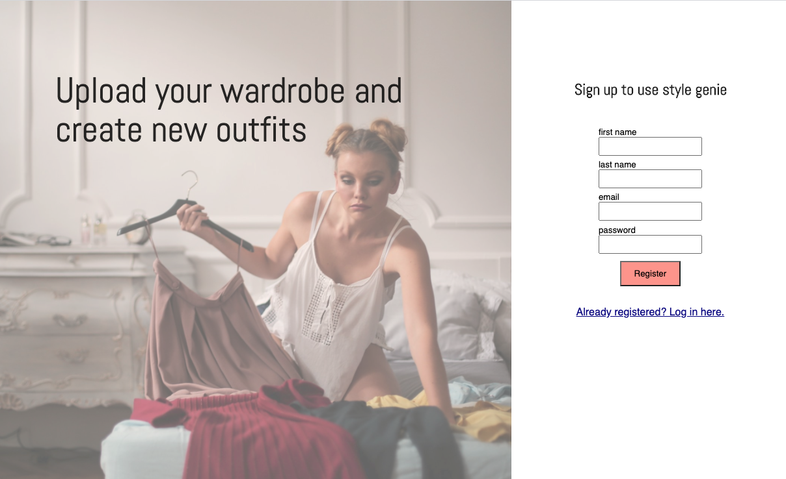

# Outfit generator

### Final project as part of the Full Stack Web Development certificate course at Spiced Academy.

#### React.js, hooks, Javascript, CSS

-   Registration
-   Log in
-   Image upload
-   Designating a category
-   Randomised combination of items on button click
-   'About' section
-   Log out

After 11 weeks of learning and following the curriculum, it was time to create a project of our own.
Aready tired by the 12th week, yet still fascinated about how web dev works, I wanted my final project to be something fun.
My previous experience was in the fashion industry, so what do I think of ?! - of course: a random outfit generator!

Here it is, a site where a user can sign up, have their own account to upload photos of their clothes, and on a click of a button, get a completely random combination of those items to form a wholesome outfit for the day.

It provides ideas to be creative with your outfits, you might get ideas to combine clothes you never thought of combining! And believe me, after years of living in Berlin - no random combination is too random.

The moment when I find it extremely useful, though, is when you're standing in front of your wardrobe in the morning, still sleepy, you don't really want to get dressed, but you kinda have to... then you hear your a voice telling you 'you have _nothing_ to wear'.

# Well, Style genie is here to help you out.

#### Log in:

#### Registration:

